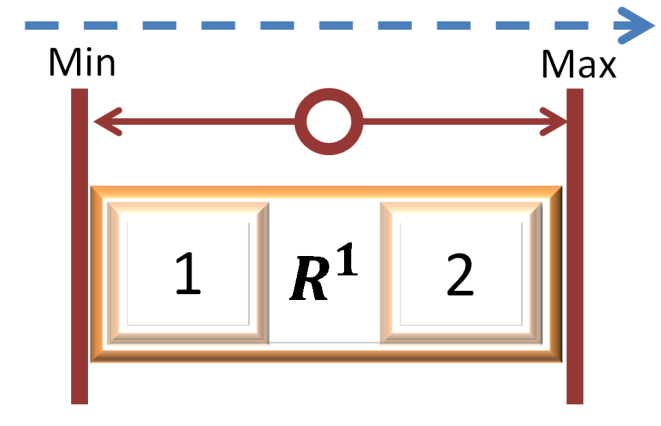
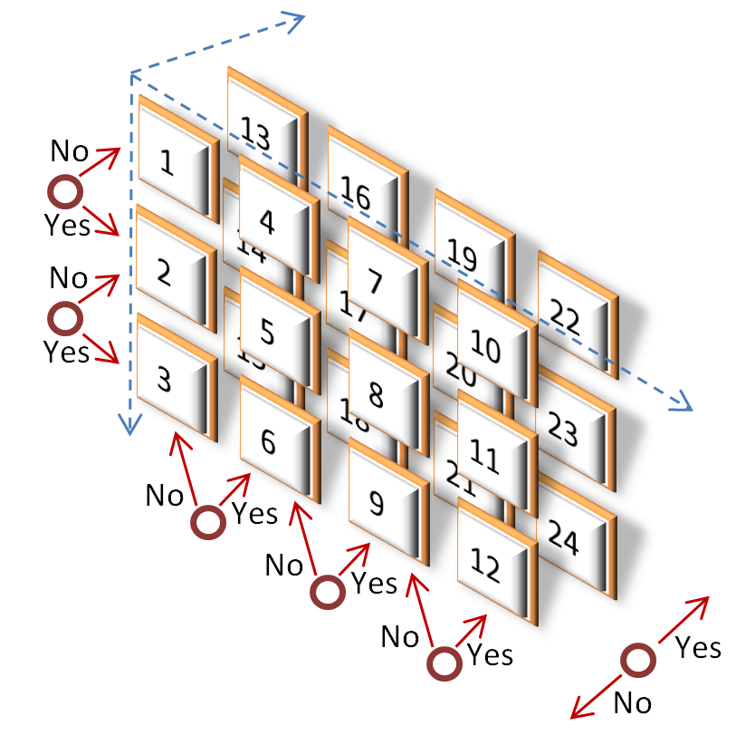

# Unlocking the Power of Prediction Markets
*Paul Sztorc  
truthcoin@gmail.com  
Version 1.2*

## Summary
This document is a short guide to the use of prediction markets (PMs). Alone, Binary PMs can be used to estimate the likelihood of any defined event, and Scaled PMs can estimate the expected value of any future quantity. However, it is when combined that PMs truly yield their powerful insights. PMs combined within-dimension can assess the probabilities of events with any number of mutually exclusive states. PMs combined across-dimension can assess joint and marginal probabilities of multiple variables. “Chained” PMs can elicit the probability density function (higher moments, multi-modality, hazard function for time series, etc.) of an event.

## Example 1 – Canonical Binary (K=1, N=2, D=1)
Consisting of a single Yes/No decision requirement, these PMs were popularized by InTrade [^1]. Participants who honestly doubt the event will happen can profit by purchasing a share of State 1, whereas those who find it likely can purchase a share of State 2. Assuming market efficiency, the price of State 2 represents the likelihood of the actual event. Above, the features of this contract are represented graphically: two States (yellow squares), one required Decision (red circle) and one Dimension (blue dashed arrow).

## Example 2 – Scaled (K=1, N=2, D=1)
“Binary” Markets have only two possible outcomes (Yes or No), making them useful for questions of likelihood, but unsuitable for questions of value. For such questions, a PM can employ “Scaled” Decisions (allowing a market to take on a value between 0 and 1 and scaling that value up into predefined bounds). Instead of interpreting States 1 and 2 as No/Yes, they would more represent Lower/Higher. As the price of ‘Lower’ increases, our expectations would proportionally shift from the midpoint towards the Minimum bound, and vice-versa.

## Example 3 – Categorical (K=k, N=(k+1), D=1)
A variable of interest might take on more than just two mutually-exclusive States. This indicates multiple categories within a variable (one of [A, B, or C]), but not gradations across a continuous variable (which of [>2, >3, and/or >4]).

For example, the weather [^2] could be described as Clear/Sunny, Cloudy/Overcast, Rain/Sleet/Hail, or Snow. Using three Decisions “Was it Cloudy/Overcast on June 21st, 2015?”, “Was it Raining (including Sleeting, Hailing) on June 21st, 2015?”, “Was it Snowing (but not Sleeting or Hailing) on June 21st, 2015?”, we could partition a PM into the 4 States desired. Clear/Sunny would be the null state (‘1’).

## Example 4 – Multidimensional Binary (K=k, N=2k, D=k)
Contracts that span two Dimensions (blue, dashed arrows) have a remarkable property: the ability to reveal the relationship between the two dimensions. For example, congressmen of 2014 can estimate the efficacy of a Jobs Bill they are considering for 2015, by constructing this Market and observing the relationship between the passage of the bill (dimension 1) and the likelihood [^3] of a future employment rate (dimension 2). If the relationship is weak, the bill will likely be ineffectual, if the relationship is negative, the bill might actually be detrimental [^4].

### Relationships Between Two-Dimensional Contracts
A layout of three 2-d PMs, with the Decision labels (“No”/“Yes”, top and left axes), joint-probabilities (center 4 squares), total probabilities (sums, right and bottom axes), shaded by density. Left: probability is relatively higher in the [No,No] cell and [Yes,Yes] cell, indicating a positive relationship between the variables. Center: when probability for one variable is high in Yes, probability in the second variable is high for No (and vice-versa), indicating a negative relationship. Right: no accumulation of excess probability anywhere, indicating that the variables have no relationship to each other.

## Example 5 – Bets Denominated in Other Currencies (K=2, N=4, D=2)
It would be really nice to have PMs denominated in something other than cryptocurrency (which is notoriously volatile). There is no need for speculators to be facing exchange risk (associated with changing exchange rates) as well as event risk (risk that an event will or will not take place). Speculators can **focus on only those risks they understand best.** In the example above, speculators can estimate the likelihood of a level of 2050 global warming while simultaneously ‘going long’ the DJIA. By doing this, they are protected from USD-inflation and BTC-volatility, and only punished/rewarded based on the accuracy of their warming forecast. Professional investment banker types would be doing the opposite, shorting the DJIA (to conduct arbitrage against the long-pressure from warming-forecasters [ which ensures that traders always receive a fair deal ]) but ignoring the warming dimension completely (and thus avoiding a risk they do not understand).

## Example 6 – Mixture ( {K, N, D} = Variable)
It is possible to mix and match Binary and Scaled Decisions into any number of configurations. The configuration above would allow observers to learn the impact of an Obamacare implementation today on the life expectancy of women in 2030. We simply do as in Example 4, and calculate conditional probabilities by dividing each joint probability its marginal Obamacare probability. We are then left with two forecasts of life-expectancy: one in a world where Obamacare is passed and signed in 2010, and the other where Obamacare is not passed.

However, what if someone places such a ‘conditional bet’ (for example that  “LifeExpectancy=Higher if PassObamacare=No”), and then PassObamacare turns out to be ‘Yes’? As the hypothetical never occurred, it is unclear what should happen to the speculator’s payoff. It turns out that there are at least two ways of constructing such a ‘conditional bet’, one of which will -in expectation- refund the speculator’s money, and one under which the speculator will actually make money if the counterfactual never occurs.

For more details, see [my excel spreadsheet demo](https://github.com/psztorc/Truthcoin/raw/master/docs/LogMSR_Demo.xlsx) of MSR trading and payoffs.

## Example 7 – Multidimensional Categorical (K=k, N=∏(kd+1), D=d)
This example illustrates the flexibility of market creation opportunities, which can take on any number of Decisions, States, and Dimensions. Corporation X “CorpX” could use this device to cheaply assess which of their CEO-replacement or Fund-use decisions would maximize the probability of achieving a price target for their traded shares [^5] [^6]. Although Traders have many ways of losing, the risk is compensated by reward: early-entrants can multiply their investment by N (24 in this case). Traders are free to ignore Dimensions: By purchasing states 1-12 and 13-24 (for example) in groups, a Trader can experience the same cost, risk, and reward as a binary market on the Decision “Did CorpX 7/1/2014 stock price trade above 300 $/share?”.

## Example 8a – Chained Contracts  (K=k, N=4(k-1), D=1)
This is an inefficient form of ‘chained contracts’ that I provide for instructive value (the non-redundant form is Example 9). To estimate the continuous value of a single variable, multiple Markets must be funded [^7]. Note regions 1 through 8 correspond to the prices of states 1 through 8, forming a probability density function. State 0 indicates that the state is logically impossible and should always trade at a price of zero.  
**“Will the BTC/USD exchange rate be above (500, 1000, 1500, 2000, 2500, 3000, 3500)?”**

## Example 8b – Adding A Link
Again, this continues the example which is simply easier to visually understand, and is inefficient compared to 6. Here I describe an Author, noticing high trade volume, adding a new market to further clarify the density function. The price of 3a is given directly by the new market, and the price of 3b is implied: p(3b) = p(3) – p(3a).  
**“Will the BTC/USD exchange rate be above (1250)?”**

## Example 9 – Efficient Chained Contracts (K=k, N=2k, D=1)
This is the efficient example which, without Example 8, may have been harder to grasp visually. A group of 2-State Markets define the cumulative distribution function of a single variable. Prices of the various regions require arithmetic to compute, making them less intuitive.

## Example 10 – Complex Advice (K=(p+q), N=(2p)(2q), D=(1+q))
This set of chained Markets is highly complex yet highly informative. One possible example: (on the left) a Yes / No policy decision, such as “Will the United States declare war against the Central Powers before Jan 1st, 1918?”, and (across the top), a possible continuous outcome “Did more than [10,000; 100,000; 1,000,000; 10,000,000] Americans die in 1917?”. This market will clarify the relationship between the decision and the outcome by indicating distributional features such as variance/uncertainty, best/worst-case-scenario, and bimodality. This technique, of course, can take on an unlimited number of decision-dimensions to examine the interaction of multiple separate decisions.

Note that a market powered by LMSR (as in Truthcoin markets) allows one to selectively trade only on the information they possess (marginal, joint, total), and also prevents uninformed traders from throwing their money away: information is aggregated producing prices that make it impossible for Traders to spend anything on impossible States.

For **WELL BEHAVED, DEFINITLY PARAMETRIC** distributions, we can cheat a little by making trades ON the parameters themselves.

Caveat: **THIS WILL NOT WORK FOR NON-PARAMETRIC VARIABLES [^8].**

Warning 1: How stupid you look when you use a parametric estimate (smooth black line) to describe non-parametric data (represented by histogram [rectangles]).

Warning 2: [Anscombe’s Quartet](http://en.wikipedia.org/wiki/Anscombe%27s_quartet). Each of these 4 datasets has nearly identical ‘parameters’: The mean and variance of both x and y are the same, as are their correlation and linear regression coefficients. *Summarizing* data into two numbers *necessarily destroys* a lot of *information*…if that ‘destroyed information’ was ‘useful information’, you will make horrible mistakes.

## Example 11 – Parameter Estimation (K=1, N=(2d), D=d)
With these warnings in mind, it is well known in statistics that, if  produces the expected value (the average) of x, then Var(x)=E(x²)-(E(x))² will *produce the variance*. We can therefore set up two prediction markets, with different mathematical operations (identity, square) on the same Decision. These two parameters (mean, variance) can define many of the most popular distributions, including the normal, bounded-beta, and exponential distributions. To reach into the skewness and kurtosis (for example, to check if a supposedly normal distribution has the required skewness of 0 and kurtosis of 3), we need only to estimate E(x³) and E(x⁴), respectively. Again, the **variance represents ‘variability’** (like trees swaying in the wind), and **not ‘risk’** (military, romantic, financial phenomena…where deception is inevitable).

[^1]: http://www.youtube.com/watch?v=N_DWqeR9jqc  
[^2]: [Can Weather Forecasts Be Improved?](http://www.wired.com/wired/archive/7.02/weather.html?pg=1&topic=&topic_set=) (wired.com)  
[^3]: A Scaled Decision “What will the April 2015 unemployment rate be? [4% to 10%]” would produce two ‘expected unemployment rates’ instead of two ‘likelihoods’. This would also allow lawmakers to see exactly how much the April 2015 unemployment rate would change if the 2015 Jobs Act were passed and signed.  
[^4]: For a discussion of some of the implications of this property, see [Ending the Age of Bullshit.](http://www.truthcoin.info/presentations/info-problems.pdf)  
[^5]: Again, with a Scaled Decision “What will the closing share price of CorpX be on 7/1/2014?”, shareholders, analysts, and board members could learn the economic-value-added of these managerial choices, as opposed to the ‘likelihood of achieving’ a fixed amount of value-add.  In this case, the decision-makers will be maximizing the value of their shares, so it doesn’t matter (unless the future estimated price is too far from $300/share).  
[^6]: Because of some rather inconvenient possibilities (stock splits, share repurchases, etc.), it might be advantageous to use market capitalization instead of stock price. Restructuring activities would be even more problematic.  
[^7]: This is a requirement because there will be at least one winner (either yes or no) for each range, and all winners will need to be paid the unit price.  
[^8]: [According to Nassim Taleb](http://financialservices.house.gov/uploadedfiles/071411nassim.pdf), the kurtosis of most economic variables is epistemologically unmeasurable, and so these variables cannot be reliably Gaussian (and may as well be completely non-parametric).  